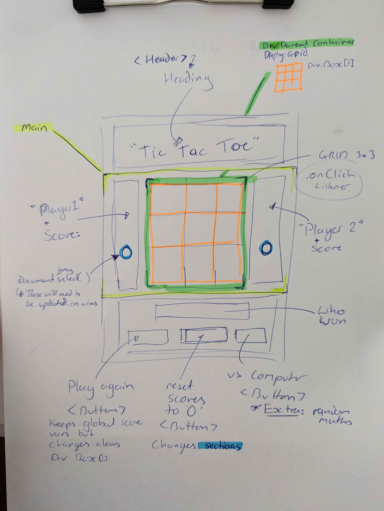

# Tic-Tac-Toe
First major project to showcase commits - 2 days to complete functioning game. 

 ---
## :page_facing_up: About
- A functioning game of Tic-Tac-Toe. The game takes turns with two human inputs as clicks on the squares. Once a game is finished, you can either 'Play again' and keep the scores running and letting each player take turns in starting the game. The game can also be reset with the 'Reset scores' button taking you back to 0 vs 0 scores. 

- Features coming soon: 'Vs the computer" - Button currently does nothing. 

## :fishing_pole_and_fish: Page url
https://ob-code.github.io/Tic-Tac-Toe/ 

## 🗒️ - Planning & Problem Solving
- Design and render a game of Tic Tac Toe in HTML/CSS and JS. 
- **Switch turns** between more than one player
- **Design logic for winning** & **visually display which player won**
- **Include separate HTML / CSS / JavaScript files**
- Use **Javascript** for **DOM manipulation**
- **Deploy your game online**, where the rest of the world can access it
- Use **semantic markup** for HTML and CSS (adhere to best practices)

- The method of finding a draw check that all boxes have been selected, but was having a double up if a win was made on the last selection. A win and draw were both declared. A win status or true/false was brought in to try and avoid this as a secondary check to see if a win had occured. 

## 🧰: Tech
---
- Programming languages: JS
- JS functions - pretty cool!
---

## :scream: Bugs to fix
//Known bugs:
- FIXED :sunglasses: No draw feature yet.
- FIXED :sunglasses: You can click on a square that has already been clicked on and it changes the turn (background stays the same)
- FIXED :sunglasses: Play again button does not clear the array so the previous selections are still counting towards the next game. 
- FIXED :sunglasses: "player [] won" still shows the winner from the previous game even when play again and reset buttons are clicked. 
- FIXED :sunglasses: Need to stop game from registering clicks once winner declared. 
- FIXED :sunglasses: Clicking on the .gameContainer changes the background - need to turn this feature off. 
- FIXED :sunglasses: Show the winning combo by changing those squares in some way.

---
## :sob: Lessons learnt
- className and classList act very differently and the more understanding around these, the more detailed changes I will be able to apply. 
- .at() = a very useful method and far less complex than splice and slice. 
- .gameContainer > div:hover { in CSS: The child combinator (>) is placed between two CSS selectors. It matches only those elements matched by the second selector that are the direct children of elements matched by the first.
- https://color.adobe.com/create/color-wheel Great website for looking at colour values. 

---
## :white_check_mark: Cool things I would add if I can keep working on this
- Computer logic to vs player.
- Choose symbols for players.
- Web colour checker for accessability purposes.